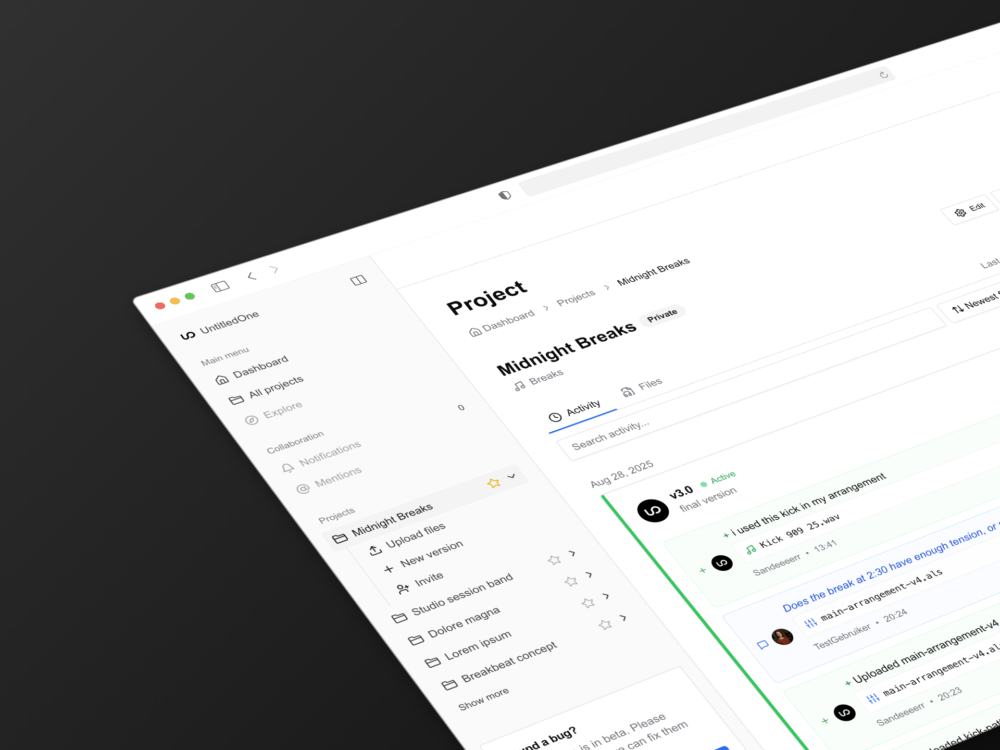

<div align="center">

  <picture>
    <source media="(prefers-color-scheme: dark)" srcset="public/images/logo.svg" />
    <source media="(prefers-color-scheme: light)" srcset="public/images/logo-dark.svg" />
    
  </picture>
  <h1>UntitledOne</h1>
  
  <p>
    Open-source platform for remote collaboration between audio creatives — file sharing, time-based feedback, and lightweight project management.
  </p>
  
  
<!-- Badges -->
<p>
  <a href="https://github.com/sandeeeerr/untitledone/graphs/contributors">
    
  </a>
  <a href="https://github.com/sandeeeerr/untitledone/commits/main">
    
  </a>
  <a href="https://github.com/sandeeeerr/untitledone/network/members">
    
  </a>
  <a href="https://github.com/sandeeeerr/untitledone/stargazers">
    
  </a>
  <a href="https://github.com/sandeeeerr/untitledone/issues/">
    
  </a>
  <a href="https://github.com/sandeeeerr/untitledone/blob/main/LICENSE">
    
  </a>
</p>
   
<h4>
    <a href="https://untitledone.nl">View Demo</a>
  <span> · </span>
    <a href="https://docs.untitledone.nl">Documentation</a>
  <span> · </span>
    <a href="https://github.com/sandeeeerr/untitledone/issues/new?labels=bug&template=bug_report.md">Report Bug</a>
  <span> · </span>
    <a href="https://github.com/sandeeeerr/untitledone/issues/new?labels=enhancement&template=feature_request.md">Request Feature</a>
  </h4>
</div>

<br />

<!-- Table of Contents -->
# 📔 Table of Contents

- [About the Project](#about-the-project)
  * [Screenshots](#screenshots)
  * [Tech Stack](#tech-stack)
  * [Features](#features)
  * [Project Structure](#project-structure)
  * [Internationalization](#internationalization)
  * [Environment Variables](#environment-variables)
- [Getting Started](#getting-started)
  * [Prerequisites](#prerequisites)
  * [Installation](#installation)
  * [Running Tests](#running-tests)
  * [Run Locally](#run-locally)
  * [Deployment](#deployment)
- [Development Workflow](#development-workflow)
- [Usage](#usage)
- [Goal & Scope](#goal--scope)
- [Design Principles](#design-principles)
- [Architecture & Rationale](#architecture--rationale)
- [Data & Storage](#data--storage)
- [Accessibility & Performance](#accessibility--performance)
  * [Color Reference](#color-reference)
- [Roadmap](#roadmap)
- [Contributing](#contributing)
  * [Code of Conduct](#code-of-conduct)
- [FAQ](#faq)
- [Security](#security)
- [License](#license)
- [Contact](#contact)
- [Acknowledgements](#acknowledgements)
  

<!-- About the Project -->
## ✨ About the Project

UntitledOne makes it easy to share music projects, discuss versions, and annotate audio with precise timestamps. Built for speed, simplicity, and modularity on a modern web stack.


<!-- Screenshots -->
### 📸 Screenshots

<div align="center"> 
  
</div>


<!-- TechStack -->
### 👾 Tech Stack

<details>
  <summary>Client</summary>
  <ul>
    <li><a href="https://www.typescriptlang.org/">TypeScript</a></li>
    <li><a href="https://nextjs.org/">Next.js 15 (App Router, RSC)</a></li>
    <li><a href="https://react.dev/">React 19</a></li>
    <li><a href="https://tailwindcss.com/">Tailwind CSS</a></li>
    <li><a href="https://ui.shadcn.com/">shadcn/ui</a> + <a href="https://www.radix-ui.com/">Radix UI</a></li>
    <li><a href="https://tanstack.com/query/latest">TanStack Query</a></li>
    <li><a href="https://react-hook-form.com/">React Hook Form</a> + <a href="https://zod.dev/">Zod</a></li>
    <li><a href="https://next-intl-docs.vercel.app/">next-intl</a></li>
  </ul>
  
</details>

<details>
  <summary>Server</summary>
  <ul>
    <li><a href="https://nextjs.org/">Next.js Server Actions</a></li>
    <li><a href="https://supabase.com/">Supabase</a> (Auth, RLS, Storage)</li>
    <li><a href="https://supabase.com/docs/guides/functions">Supabase Edge Functions</a></li>
    <li><a href="https://resend.com/">Resend</a> (email)</li>
    <li><a href="https://vercel.com/">Vercel</a> (hosting)</li>
  </ul>
</details>

<details>
<summary>Database</summary>
  <ul>
    <li><a href="https://www.postgresql.org/">PostgreSQL</a> (via Supabase)</li>
    <li><a href="https://supabase.com/docs/guides/storage">Supabase Storage</a></li>
  </ul>
</details>

<details>
<summary>Dev & Testing</summary>
  <ul>
    <li><a href="https://vitest.dev/">Vitest</a></li>
    <li><a href="https://www.cypress.io/">Cypress</a></li>
    <li><a href="https://eslint.org/">ESLint</a> + <a href="https://prettier.io/">Prettier</a></li>
  </ul>
</details>


<!-- Features -->
### 🎯 Features

- Private projects with audio-first uploads (Supabase Storage)
- Timestamped, threaded comments on waveforms
- Mentions, notifications, and invitations
- Activity overview and version context
- Strict RLS policies with Supabase
- Modern UI with shadcn/ui + Radix, Tailwind, and dark mode

#### Features at a glance

- 👥 Projects & roles (owner/collaborator/viewer); invite or leave easily
- 🔗 Share without friction: email invites or time-limited share links (revocable)
- 🧑‍🎤 Public profiles to showcase selected projects
- ☁️ Upload and manage files (drag-and-drop, descriptions, link to versions)
- 🔁 Versioning with one active version to stay focused
- 🗄️ BYOS: connect Dropbox or Google Drive via OAuth + signed URLs
- ⏱️ Time-coded comments in the waveform; threads with resolve/unresolve
- 🔔 Mentions and notifications (unread/all) with deep links
- 🗓️ Activity timeline: uploads, versions, comments, team changes
- 🌓 Light/Dark theme with solid contrast; keyboard-friendly
- 🌍 EN/FR/NL interface with localized dates


<!-- Project Structure -->
### 📁 Project Structure

```text
src/
├─ app/                         # Next.js App Router (server-first)
│  └─ (routes)/…                # feature routes (e.g., dashboard, project, auth)
├─ components/                  # Atomic Design + shadcn/ui
│  ├─ atoms/  ├─ molecules/  ├─ organisms/  ├─ templates/  └─ ui/
├─ hooks/                       # custom hooks
├─ i18n/                        # next-intl (messages/, routing)
├─ lib/                         # api/, supabase/, env.ts, utils.ts
├─ stories/                     # Storybook
├─ types/                       # Supabase schema types (generated)
└─ styles/                      # globals.css, tailwind.css (optional)
```


<!-- Env Variables -->
### 🌐 Internationalization

UntitledOne supports multiple locales via next-intl. Translation files live in `src/i18n/messages/`.

- Available locales: `en`, `fr`, `nl`
- Add new languages by creating a `{locale}.json` file and wiring it in `src/i18n/request.ts`


### 🔑 Environment Variables

Create a `.env.local` with:

```
SUPABASE_URL=
SUPABASE_ANON_KEY=
SUPABASE_SERVICE_ROLE_KEY=
SUPABASE_DB_URL=
RESEND_API_KEY=
NEXT_PUBLIC_SITE_URL=
```


<!-- Getting Started -->
## 🧰 Getting Started

<!-- Prerequisites -->
### ❗ Prerequisites

This project uses npm as the package manager.

```bash
node -v   # Node.js 18+
npm -v
```

<!-- Installation -->
### ⚙️ Installation

Clone and install:

```bash
git clone https://github.com/sandeeeerr/untitledone.git
cd untitledone
npm install
```

Configure env (see above), then start dev:

```bash
npm run dev
# http://localhost:3000
```
   
<!-- Running Tests -->
### 🧪 Running Tests

```bash
npm run test           # unit tests (Vitest)
npm run cypress:open   # E2E (Cypress)
```

<!-- Run Locally -->
### 🏃 Run Locally

Common scripts:

```bash
npm run dev          # dev server
npm run typecheck    # TypeScript
npm run lint         # ESLint
npm run format       # Prettier
npm run gen:types    # generate Supabase DB types
npm run storybook    # Storybook
```

<!-- Deployment -->
### 🚩 Deployment

Recommended: deploy on Vercel.

```bash
# Configure environment variables in Vercel dashboard
# Then push to main or create a Production Deployment
```


<!-- Usage -->
## 👀 Usage

1. Sign in via the auth flow
2. Create a project and upload an audio file
3. Add timestamped comments; discuss versions in context
4. Invite collaborators to work together


## 🧠 Goal & Scope

UntitledOne helps audio creatives share work, version files, and give time-based feedback in a calm, focused interface. The goal is to reduce friction in collaboration while keeping decisions traceable through an activity timeline.

- Focus: collaboration on audio files (projects, versions, comments, invites)
- Audience: audio creatives working primarily on desktop with DAWs
- Scope v1.0: robust desktop experience with a usable mobile fallback


## 🧩 Design Principles

- Start with functionality, refine later: prioritize clear hierarchy and flows, then polish spacing, type, and color
- Atomic UI: atoms → molecules → organisms; small, reusable, accessible components
- Predictable states: explicit loading skeletons, empty states, errors; toasts with text + icon (not color alone)
- Visual hierarchy: emphasize by de-emphasizing; primary actions stand out, metadata stays subtle
- Theme parity: light/dark share the same type, spacing, and contrast scales


## 🧱 Architecture & Rationale

- Stack: Next.js (App Router, RSC) + Supabase (Auth, Postgres, Storage) + Tailwind + shadcn/ui + Radix
- Pragmatic monolith: server-first interactions reduce client complexity and cognitive overhead
- Omitted for v1.0: microservices, tRPC; unnecessary surface area for an MVP
- Open-source friendly: MIT license, self-hostable, low-cost defaults


## 🗄️ Data & Storage

- Postgres (via Supabase) as source of truth with strict RLS policies
- Files either in Supabase Storage or external BYOS (Dropbox/Google Drive) via OAuth + signed URLs
- Versioning: a replace creates a new record; one version is marked active for clarity
- Free tier constraint: 50 MB platform uploads for quick trials without external accounts


## ♿ Accessibility & Performance

- Accessibility: Radix primitives, logical focus order, ARIA landmarks; no color as sole indicator
- Internationalization: `en`, `fr`, `nl` via next-intl; localized dates and messages
- Performance: server-first to limit client bundles; lazy-load interactive parts; monitor with Lighthouse/Web Vitals

### 🎨 Color Reference

| Token | Light (HSL) | Dark (HSL) |
| --- | --- | --- |
| background | `0 0% 100%` | `240 10% 3.9%` |
| foreground | `240 10% 3.9%` | `0 0% 98%` |
| primary | `220 90% 56%` | `220 80% 60%` |
| secondary | `240 4.8% 95.9%` | `240 3.7% 15.9%` |
| accent | `240 4.8% 95.9%` | `240 3.7% 15.9%` |
| destructive | `0 84.2% 60.2%` | `0 62.8% 30.6%` |
| border/input | `240 5.9% 90%` | `240 3.7% 15.9%` |
| ring | `240 5.9% 10%` | `240 4.9% 83.9%` |


<!-- Roadmap -->
## 🧭 Roadmap

- [x] Core collaboration: projects, timestamped comments, invitations
- [x] Mentions and notifications
- [ ] Roles/permissions and project sharing presets
- [ ] Advanced waveform player and version diffing
- [ ] Integrations and AI-assisted feedback

See GitHub Projects: `https://github.com/sandeeeerr/untitledone/projects`


<!-- Contributing -->
## 👋 Contributing

<a href="https://github.com/sandeeeerr/untitledone/graphs/contributors">
  
</a>

Contributions are always welcome! Please follow Conventional Commits and our guidelines.

See `CONTRIBUTING.md` for ways to get started.


<!-- Code of Conduct -->
### 📜 Code of Conduct

Please read the [Code of Conduct](./CODE_OF_CONDUCT.md)


<!-- FAQ -->
## ❓ FAQ

- How are secrets handled?

  + Secrets never ship to the client bundle. Only `NEXT_PUBLIC_*` variables are used client-side.

- Can I use my own Supabase project?

  + Yes. Create a project, run the migrations in `supabase/migrations/`, then `npm run gen:types`.


<!-- Security -->
## 🔒 Security

Report vulnerabilities privately via `SECURITY.md`.


<!-- License -->
## ⚠️ License

Distributed under the MIT License. See `LICENSE` for more information.


<!-- Contact -->
## 🤝 Contact

Author: Sander de Vries — open an issue for questions/feedback

Project Link: [github.com/sandeeeerr/untitledone](https://github.com/sandeeeerr/untitledone)


<!-- Acknowledgments -->
## 🧪 Development Workflow

Core scripts to keep quality high:

```bash
npm run lint         # ESLint
npm run typecheck    # TypeScript
npm run test         # Unit tests (Vitest)
npm run cypress:open # E2E locally
```

## 💎 Acknowledgements

- <a href="https://nextjs.org/">Next.js</a>
- <a href="https://supabase.com/">Supabase</a>
- <a href="https://ui.shadcn.com/">shadcn/ui</a> + <a href="https://www.radix-ui.com/">Radix UI</a>
- <a href="https://tanstack.com/query/latest">TanStack Query</a>
- <a href="https://cypress.io/">Cypress</a> · <a href="https://vitest.dev/">Vitest</a>
- <a href="https://shields.io/">Shields.io</a> for badges

